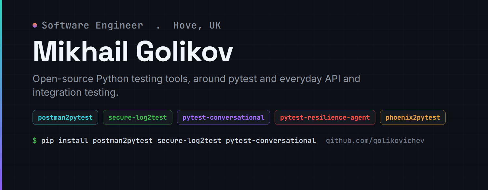

### Hi, I'm Mikhail

QA engineer based in Hove, UK. I build open-source Python tools for testers, mostly around pytest and the everyday problems of API and integration testing: brittle test data, slow suites, and the gap between the tools teams already use (Postman, Kibana) and proper test code.

    

### Featured projects

| Project | What it does |
|---|---|
| **[postman2pytest](https://github.com/golikovichev/postman2pytest)**  | Convert Postman v2 collections into runnable pytest suites: auth headers, env vars, parametrised fixtures. |
| **[secure-log2test](https://github.com/golikovichev/secure-log2test)**  | Generate pytest regression tests from anonymised Kibana log exports, with PII redacted by default. |
| **[pytest-conversational](https://github.com/golikovichev/pytest-conversational)**  | pytest plugin for deterministic multi-turn dialogue testing. No LLM dependency. |
| **[phoenix2pytest](https://github.com/golikovichev/phoenix2pytest)**  | Turn production LLM failures into regression tests, automatically. |
| **[pytest-resilience-agent](https://github.com/golikovichev/pytest-resilience-agent)**  | Auto-generate resilience tests for LLM apps from a Lark grammar. |

### Writing

- SD Times: [Don't let the model grade its own homework](https://sdtimes.com/test/dont-let-the-model-grade-its-own-homework/). Why an LLM should not grade its own output, and what to use instead.
- Computer Weekly (Open Source Insider): [Do one thing well: the case for small open source testing tools](https://www.computerweekly.com/blog/Open-Source-Insider/Do-one-thing-well-the-case-for-small-open-source-testing-tools). Small single-purpose testing tools versus large frameworks, from a maintainer's point of view.
- Dev.to: [Postman and pytest are living in parallel universes. Here is a bridge.](https://dev.to/golikovichev/postman-and-pytest-are-living-in-parallel-universes-heres-a-bridge-5bgn) How postman2pytest came together. Also on Medium and Hashnode.
- Dev.to: [Keep the LLM out of your chatbot tests](https://dev.to/golikovichev/keep-the-llm-out-of-your-chatbot-tests-236a). Why deterministic dialogue testing beats an LLM-as-judge, the idea behind pytest-conversational.
- Dev.to: [Green unit tests are a comfort blanket](https://dev.to/golikovichev/green-unit-tests-are-a-comfort-blanket-40ag). Property-based fuzzing found five real crash bugs my green suite missed.
- HackerNoon: [Turn your Postman collection into pytest tests with one command](https://hackernoon.com/turn-your-postman-collection-into-pytest-tests-with-one-command) and [Turn Kibana logs into pytest cases without leaking secrets](https://hackernoon.com/turn-kibana-logs-into-pytest-cases-without-leaking-secrets).
- Habr (RU): [postman2pytest](https://habr.com/ru/articles/1033658/), [secure-log2test](https://habr.com/ru/articles/1035576/), and [keeping the LLM out of chatbot tests](https://habr.com/ru/articles/1046277/).

### How I work

Sole QA on backend e-commerce. I own API testing across 12+ Postman collections plus a regression suite of 200+ cases, and I maintain an internal Selenium and pytest framework (POM) that other testers on the team picked up from our git. Most of my time goes into root cause analysis with Grafana, Kibana and SQL, and into cutting down flaky tests so they stop costing the team momentum.

### Where to find me

   

I also contribute fixes upstream now and then (a couple landed in pytest-bdd) and chime in on pytest-dev Discussions. Found a real bug in any tool above? Opening an issue is the fastest way to my attention.
